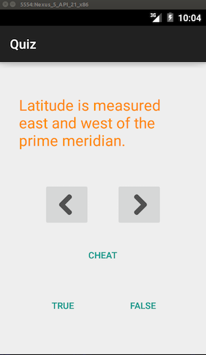

# 🌐 geo-quiz

> This quiz application tests the user's knowledge of geography.



## 🚀 Getting Started

1. ``` $ git clone https://github.com/ragmha/geo-quiz.git```

2. Open the file on [Android Studio](https://developer.android.com/studio/index.html) or other < your ♥️ IDE >

3. Compile and Run! 🚀


## License
[Apache](./license) © [Raghib Hasan](http://raghibm.com/)
