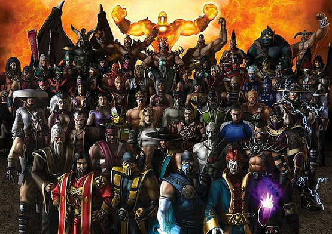

# mk-characters [](https://travis-ci.org/ragmha/mk-characters) [](https://codecov.io/gh/ragmha/mk-characters)

> Get Mortal Kombat character names.



## Install

```
npm install --save mk-characters

```

## Usage

```js
const mkCharacters = require('mk-characters');

mkCharacters.random();
//=> 'Scorpion'

```

## API

### .all

Type: `array`

Top 76 mortal-kombat characters in alphabetical order.

### .random()

Type: `function`

Random mortal-kombat character name.

### .random(id:number)

Type: `function`

Specified number of mortal-kombat characters.

## CLI

```
npm install --global mk-characters
```

```
$ mk-characters --help

Examples
    $ mkCharacters

    Scorpion

    $ mkCharacters --all
    ace
    amazing
    ...

  Options
    --all  Get all the Mortal-Kombat characters
```

## License

MIT © [Raghib Hasan](http://raghibm.com)
