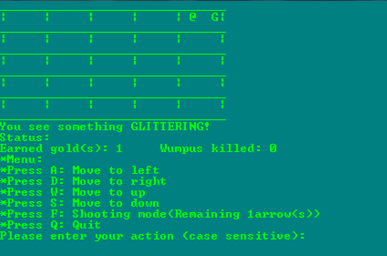

# :ghost: WuMpUs

> `Hunt the Wumpus` is an early video game, based on a simple hide and seek format featuring a mysterious monster (the Wumpus) that lurks deep inside a network of rooms.



### Getting started :video_game:

## Step 1
```
$ git clone https://github.com/ragmha/WuMpUs.git

```

## Step 2
> Open the file on [Microsoft Visual Studio](https://www.visualstudio.com/vs/) or other < your ♥️ IDE >

## Step 3
> Compile and Run! 🚀


## Note ✋ ⚠️
> This only works only on `windows` , 🔧 support for `linux` will be added someday 😂

## LICENSE
[MIT](./LICENSE)
